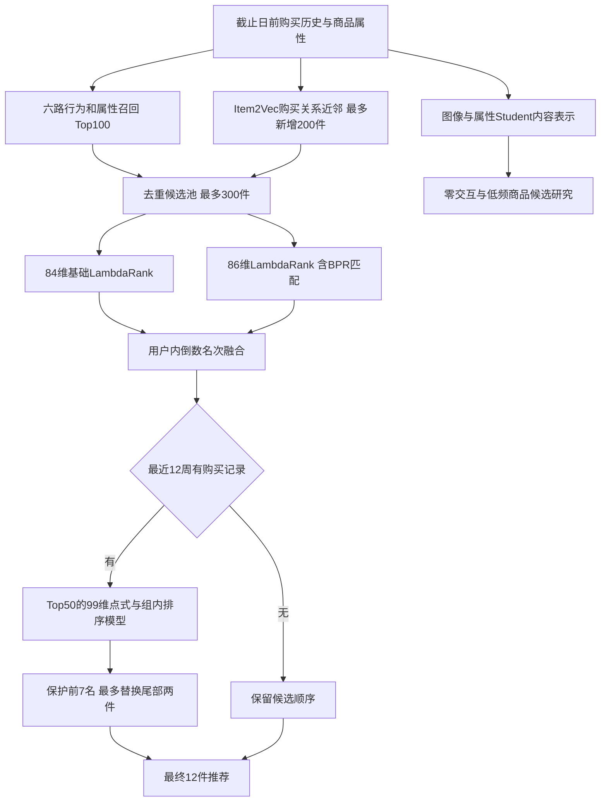

# 架构与代码路线

## 推荐主干

六路来源为复购、近期热度、商品家族、同日共同购买、年龄分组热度、属性相似。Item2Vec追加与基础前100去重后的商品。BPR用户向量与商品向量内积用于排序特征，不在此结构中承担独立召回。

两处排序模型融合采用RRF（行业通用倒数名次融合），公式为`1/(60+r_a) + 1/(60+r_b)`；名次在每个用户内计算。上层融合只指导原第13–50名商品对原第8–12名商品的替换，不直接重排整张列表。

Student内容分支与推荐主干分别验证。当前展示结果没有把冷分支描述成已部署或已改善最终推荐。

## 建议阅读顺序

| 文件 | 关注点 |
|---|---|
| `src/hm_recsys/data.py`、`baseline.py`、`metrics.py` | 截止日边界、简单召回、指标分母 |
| `m1.py`、`m2.py`、`m29.py` | 多路候选、候选级特征、Item2Vec来源缓存 |
| `warm_v2_engine.py`、`warm_v2_features.py` | 行为主干、协同匹配与特征构建 |
| `warm_v3_clean_model_replay.py` | 不读取购买标签的融合与替换动作 |
| `mind_warm_final_confirmation.py` | 冻结时间确认与最终推荐重放 |
| `m4_teacher.py`、`m4_student.py`、`m4_retrieval.py` | 购买关系监督、内容编码器、等预算召回 |
| `final_temporal_item_e16.py`、`final_f70_explainability_audit.py` | 商品时效特征、低频与零交互诊断 |
| `final_integration.py`及对应测试 | 冷分支与主干集成的收益门槛 |

`m*`、`p*`、`warm_v*`等前缀是项目阶段编号，不是行业标准模型名。旧模块中有后来废弃的方案；以这里标注的代码路线理解最终结构，不能将全部研究模块拼成一个已验收系统。
